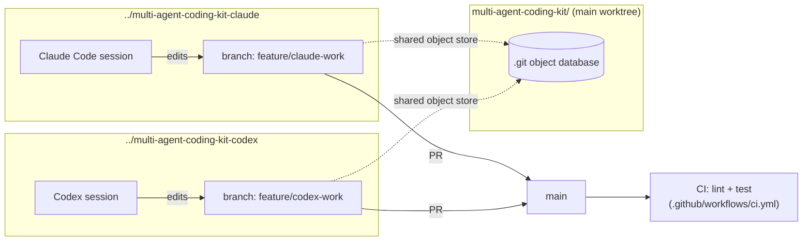

# multi-agent-coding-kit

**Run Claude Code and an OpenAI Codex/GPT-based agent side-by-side on the same project — in isolated git worktrees — without them stepping on each other's files.**

[](LICENSE)
[](https://github.com/pavan3031/multi-agent-coding-kit/stargazers)
[](https://github.com/pavan3031/multi-agent-coding-kit/actions/workflows/ci.yml)

## Why

Running two coding agents on the same checkout is a recipe for lost work: one agent's edit clobbers the other's mid-write, or you spend more time reconciling diffs than either agent spent writing code. `multi-agent-coding-kit` gives each agent its own **git worktree** — a separate working directory backed by the same repo — so they can edit files in parallel without clobbering each other's in-progress changes on disk, and merge their work back through ordinary pull requests. Worktrees eliminate *filesystem* collisions; they don't eliminate normal Git *merge* conflicts if both agents touch the same file — see the [FAQ](#faq).

## Quickstart

```bash
# 1. Clone the template
git clone https://github.com/pavan3031/multi-agent-coding-kit.git
cd multi-agent-coding-kit

# 2. Create isolated worktrees for each agent, both from the same base commit
#    (idempotent, safe to re-run)
scripts/setup-worktrees.sh
# or with custom branch names:
# scripts/setup-worktrees.sh feature/claude-work feature/codex-work

# 3. Edit TASKS.md to define who owns what (files/directories, not just tasks)

# 4. Launch each agent in its own worktree
scripts/launch-claude.sh   # cd's into ../multi-agent-coding-kit-claude and runs `claude`
scripts/launch-codex.sh    # cd's into ../multi-agent-coding-kit-codex and runs `codex`

# 5. When a task is done, the AGENT opens a PR from its branch into main —
#    agents never merge directly to main themselves.
#    CI lints + tests every PR the same way, regardless of which agent wrote it.
gh pr create --base main --head feature/claude-work
```

When you're done, tear the worktrees down (branches are kept):

```bash
scripts/cleanup-worktrees.sh
```

## Example session

`claude` and `codex`, each in their own worktree, each doing their `TASKS.md`-assigned scope:

```console
$ ./scripts/setup-worktrees.sh
Creating worktree ../multi-agent-coding-kit-claude on new branch feature/claude-work (from main @ a1b2c3d)
Creating worktree ../multi-agent-coding-kit-codex on new branch feature/codex-work (from main @ a1b2c3d)

Worktrees ready (base: main @ a1b2c3d):
   Claude: ../multi-agent-coding-kit-claude   (branch: feature/claude-work)
   Codex:  ../multi-agent-coding-kit-codex    (branch: feature/codex-work)

$ cd ../multi-agent-coding-kit-claude
$ claude -p "Create examples/sample-app/src/api/health.js exporting a health() \
    function returning 'ok'. ES module syntax." --allowedTools Write
Created `examples/sample-app/src/api/health.js` exporting a `health` function
that returns `'ok'`.

$ cd ../multi-agent-coding-kit-codex
$ codex exec --sandbox workspace-write "Create examples/sample-app/src/cli/index.js \
    exporting a cli() function returning 'cli'. ES module syntax."
Created only `examples/sample-app/src/cli/index.js`:

  export function cli() {
    return 'cli';
  }

# The human maintainer reviews both PRs and merges into main.
# (Agents never merge to main themselves — see CLAUDE.md/AGENTS.md.)
```

Both agents started from the exact same commit, edited disjoint files, and opened separate PRs — no working-directory collisions, and in this case no merge conflicts either. `docs/demo.tape` is a [VHS](https://github.com/charmbracelet/vhs) script that replays a session like this one — see [Rendering the demo GIF](#rendering-the-demo-gif) to turn it into a video.

## Architecture

Each agent gets its own working directory, checked out from the same `.git`, on its own branch, both starting from the identical base commit. Nothing is shared except the object database — so file edits in one worktree can never race with edits in another. This isolates *filesystem* writes; it does not by itself prevent a *merge* conflict if both branches later change the same lines (see [FAQ](#faq)).



- **TASKS.md** is the contract: it maps tasks to owner, branch, status, and owned files/directories, so each agent (and any human reviewer) knows the boundaries. It's shared coordination metadata — each agent may edit only the `Status` cell of its own row; everything else needs the human maintainer's approval.
- **CLAUDE.md** and **AGENTS.md** carry the same shared rules (coding style, test commands, "stay in your scope") so both agents behave consistently — Claude Code reads `CLAUDE.md`, Codex/GPT-based agents read `AGENTS.md`.
- **scripts/** automate creating, launching, and tearing down the worktrees, and resolve the correct paths whether run from the main repo or from inside a worktree.
- **tests/integration.sh** exercises the scripts themselves (worktree creation, branch/base-commit correctness, idempotency, cleanup safety) against a disposable clone — run in CI on every push.
- **examples/sample-app/** is a tiny Node app that exists purely so the scripts and CI have something real to operate on.

## Requirements

- [git](https://git-scm.com/) 2.5+ (worktree support)
- [GitHub CLI (`gh`)](https://cli.github.com/) for creating/merging PRs from the terminal
- [Claude Code](https://docs.claude.com/en/docs/claude-code/overview) (`claude` CLI)
- [OpenAI Codex CLI](https://github.com/openai/codex) or an equivalent GPT-based coding agent (`codex` CLI) — swap in whatever agent you use, as long as it reads `AGENTS.md`
- Node.js 20+ (only needed to run/lint/test `examples/sample-app`)

## Rendering the demo GIF

The repo ships a [VHS](https://github.com/charmbracelet/vhs) script at [docs/demo.tape](docs/demo.tape) that scripts the whole quickstart flow. To render it:

```bash
# macOS
brew install vhs

# Windows
winget install charmbracelet.vhs Gyan.FFmpeg tsl0922.ttyd

# Linux — see https://github.com/charmbracelet/vhs#installation

vhs docs/demo.tape   # writes docs/demo.gif
```

Then add `` near the top of this README.

Prefer a terminal recording over a scripted one? Use [asciinema](https://asciinema.org/) and [agg](https://github.com/asciinema/agg):

```bash
asciinema rec demo.cast
agg demo.cast docs/demo.gif
```

## FAQ

**Can I use 3+ agents?**
The underlying pattern (`git worktree add ../repo-<agent> <branch> <base-sha>`) works for any number of agents, but `scripts/setup-worktrees.sh` as shipped is hard-coded to two (Claude and Codex). Adding a third means copying the script's `create_worktree` call for a new agent and a matching `launch-<agent>.sh`, plus a corresponding row in `TASKS.md` — it's not a one-line config change in this version.

**What if both agents touch the same file?**
Don't let them — that's what `TASKS.md`'s ownership column and the "never edit files outside your assigned scope" rule in `CLAUDE.md`/`AGENTS.md` are for. There's no "small shared-file exception": if a change genuinely needs to touch a file outside an agent's scope (e.g. `package.json`), the agent records the requested change in its PR description or handoff notes instead of editing it directly, and a human or the owning agent makes that edit.

**How does CI catch conflicts?**
Worktrees prevent *working-directory* conflicts (two processes writing the same file on disk at once). They don't prevent *merge* conflicts, which are a normal git problem solved the normal way: `.github/workflows/ci.yml` runs lint + test on every PR into `main`, so a bad merge or a semantic conflict between the two agents' branches is caught before it lands, regardless of which agent (or human) opened the PR.

**Do the agents need to know about each other?**
Not directly — each only needs to read its own file (`CLAUDE.md` or `AGENTS.md`) and `TASKS.md`. The shared-rules block in both files is kept identical so behavior is consistent even though the agents never communicate directly.

## Contributing

Issues and PRs welcome. If you're proposing a change to the shared rules, edit the block between `<!-- SHARED-RULES-START -->` and `<!-- SHARED-RULES-END -->` in **both** `CLAUDE.md` and `AGENTS.md` so they stay in sync.

## License

[MIT](LICENSE)
